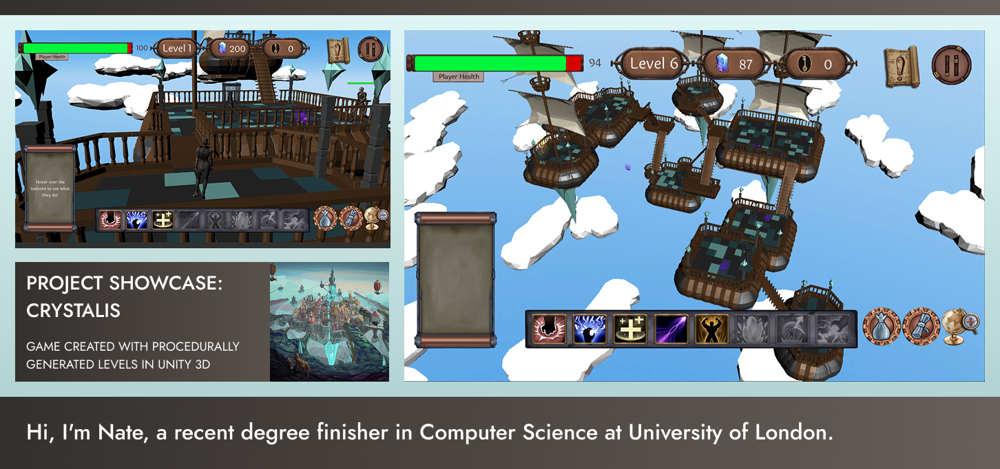

  

### Here are some of the different languages I have experience in:

  

    
       Python
    
    
       Django
    
    
       JavaScript
    
    
       C#
    
    
       C++
    
    
       Unity
    
    
       React
    
    
       MySQL
    
    
       PostgreSQL
    
    
       Node.js
    
  

Python, Django, JS, C#, React, Unity, C++, MySQL, PostgreSQL, Node.js

### Please take a look at some of my projects below and let me know if you are interested in collaborating. 
LinkedIn: [in/nate-bentley-6251061a2](https://www.linkedin.com/in/nate-bentley-6251061a2/)

<!--
**NateSamuel/NateSamuel** is a ✨ _special_ ✨ repository because its `README.md` (this file) appears on your GitHub profile.

Here are some ideas to get you started:

- 🔭 I’m currently working on ...
- 🌱 I’m currently learning ...
- 👯 I’m looking to collaborate on ...
- 🤔 I’m looking for help with ...
- 💬 Ask me about ...
- 📫 How to reach me: ...
- 😄 Pronouns: ...
- ⚡ Fun fact: ...
-->
